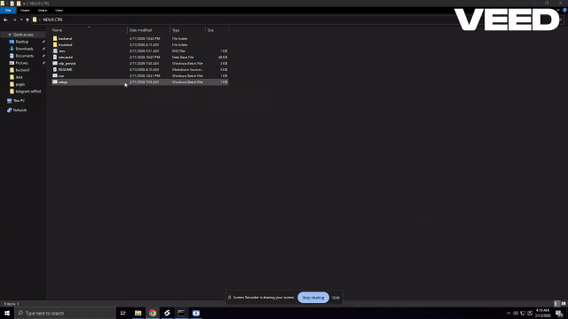

# NexusCtrl - Personal RDP Server Management Tool

## ⚠️ Important Security Notice
**This tool is designed for personal use only.** The frontend should only be accessible from your own PC to prevent unauthorized access. By default, the application binds to localhost (127.0.0.1) and should remain restricted to your local machine to prevent hackers from accessing and changing your server configurations.

## About This Project

This is a personal project I built to help manage multiple RDP servers more easily. I'm not particularly skilled at frontend development, so this is primarily a backend-focused tool with a functional interface for monitoring and controlling my servers. It started as a test for myself but became quite useful for managing multiple RDP connections.

------------------------------------------------------------------------

## 🎬 Preview

### Setup Process



### NexusCtrl Dashboard View


------------------------------------------------------------------------

## Features

### Server Monitoring
- Real-time CPU, RAM, and network usage tracking
- Live screen capture from connected agents
- Active process monitoring with kill capability
- Performance history charts

### Task Management
- Create and manage tasks
- Set priorities (critical, high, medium, low)
- Track task completion status

### Server Control
- View active processes
- Terminate processes remotely
- Monitor server status (online/offline)

### Agent Capabilities
- Runs as a background service on target machines
- Collects system metrics (CPU, RAM, network, processes)
- Captures screen for remote viewing
- Responds to remote commands (like killing processes)

## How It Works

The system consists of two parts:
1. **Backend Server** (written in Python/FastAPI) - runs on your main control machine
2. **Agent** (written in Python) - runs on each server you want to monitor

The agent connects to the backend via WebSocket and continuously sends system metrics. The frontend provides a dashboard to view this information and send commands.

## Prerequisites

- Python 3.8+
- Node.js and npm (for the frontend)
- Windows/Linux/macOS (agent works on all platforms)

## Installation & Setup

### Backend Setup
1. Clone the repository
2. Navigate to the backend directory
3. Install Python dependencies:
   ```bash
   pip install -r requirements.txt
   ```
4. Set up environment variables in `.env` file:
   ```
   SECRET_KEY=your-very-secure-secret-key
   AGENT_SECRET=your-agent-authentication-secret
   ```

### Frontend Setup
1. Navigate to the frontend directory
2. Install dependencies:
   ```bash
   npm install
   ```
3. Start the development server:
   ```bash
   npm run dev
   ```

### Running the Application

1. **Start the backend server:**
   ```bash
   cd backend
   python app.py
   ```
   Or with uvicorn:
   ```bash
   uvicorn app:app --reload --host 127.0.0.1 --port 8000
   ```

2. **Start the frontend:**
   ```bash
   cd frontend
   npm run dev
   ```

3. **Run the agent on each server you want to monitor:**
   ```bash
   cd backend
   python agent.py
   ```
   
   Make sure to update the `BACKEND_URL` in `agent.py` to match your backend server's address.

## Security Configuration

By default, the backend server listens on `127.0.0.1:8000`. This is intentional for security. Do NOT expose this port publicly. If you need remote access, use VPN or SSH tunneling.

The CORS configuration in `app.py` should be reviewed to only allow origins you trust:
```python
CORS_ORIGINS: list[str] = ["http://localhost:5173", "http://localhost:3000"]
```

## Usage

1. Access the frontend at `http://localhost:5173` (or wherever your frontend is hosted)
2. The dashboard will show connected servers and their metrics
3. Use the Process Manager to view and kill processes
4. Manage tasks using the task manager panel
5. View live screen feeds from your servers

## Limitations & Considerations

- This is a personal project, not enterprise-grade software
- Frontend design is basic and functional rather than polished
- Designed for single-user personal use
- Requires Python on monitored servers to run the agent
- Screen capture feature may not work on some locked sessions (expected behavior)

## Customization

You can modify:
- The agent to collect different metrics
- The frontend to display additional information
- The backend to store data differently
- Authentication mechanisms to fit your needs

## Troubleshooting

- If agents can't connect: Check that the `BACKEND_URL` in agent.py matches your server address
- If screen capture fails: This is expected on locked sessions or with certain security configurations
- If metrics aren't updating: Check WebSocket connections and firewall settings

## License


Personal project for educational purposes. If using this code, please respect any applicable licenses for the dependencies used.
